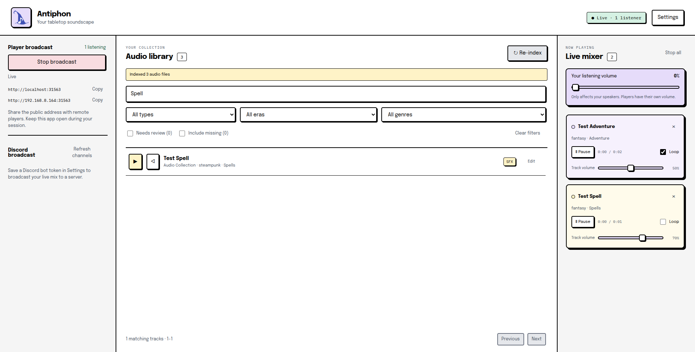
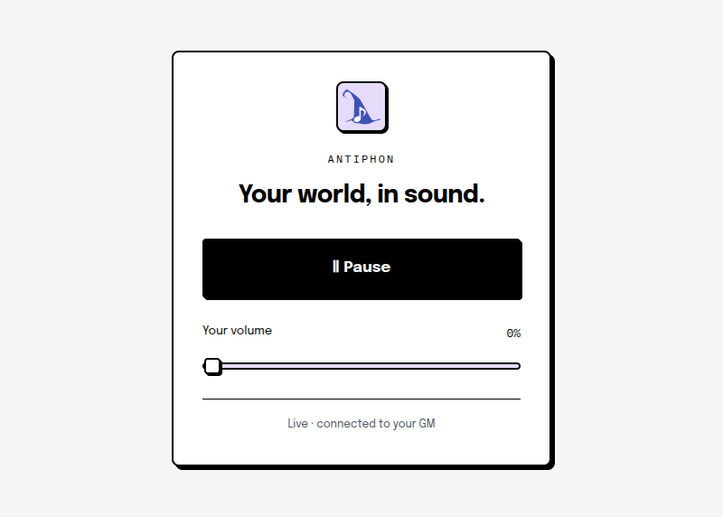

# Antiphon

**Your tabletop soundscape, from your local audio collection.**

Antiphon is a desktop app which lets game masters play their own audio tracks and stream it to their players. Be it music, ambience, or special effects, you can play it all from your PC, all locally, without handing off any data to a third party, and without any subscriptions.



- **BYO Audio.** Antiphon doesn't come with any audio pre-installed, it's designed for you to bring your own from places like [Michael Ghelfi Stuios](https://michaelghelfistudios.com/) or [Tabletop Audio](https://tabletopaudio.com/).
- **Mix your scene live.** Play several tracks at once, set each track's volume, loop background audio, and use one-shot sound effects when the moment calls for them.
- **Broadcast your audio.** Antiphon supports streaming audio to discord via a discord bot, or directly to your players via a web interface (although this option is technical to set up), or just playing directly from your computer if you're playing in-person.
- **Privacy Respecting.** Everything happens locally, there's no accounts, no cloud servers, it's all running on your computer.
- **Automatic Categorisation.** Antiphon tries to automatically categorise your music into music/ambience/sfx, era, and genre based on the folder names & track names (more on this below).

## Installation

Go to [releases](https://github.com/ashleytowner/antiphon/releases/latest) and download the option for your operating system. Antiphon supports Windows, MacOS and Linux.

## Screenshots




## Organise your audio library

Antiphon can work with an existing collection, and it will suggest categories for files that are not already neatly organised. For the most accurate automatic categorisation, use this folder layout:

```text
My Audio Library/
  music/
    fantasy/
      Exploration/
        Into the Feywilds.ogg
  ambience/
    scifi/
      Space Station/
        Engine Hum.ogg
  sfx/
    modern/
      Weapons/
        Door Slam.ogg
```

In other words:

```text
<your library>/<music|ambience|sfx>/<era>/<genre>/<audio file>
```

Antiphon uses that structure to categorise each track by **type**, **era**, and **genre**. If a file is elsewhere, it makes a best-effort suggestion and puts uncertain results in a review list; you can change any category yourself. It also notices files that have gone missing since the last scan.

## Share your mix

### Browser players

Start **Player broadcast** in Antiphon and share one of the listening links it provides. Players open it in a browser and hear the current live mix.

Players on the same local network can use the local link directly. To share with people over the internet, you will need to port-forward Antiphon's webpage port and audio UDP port range from your router to the GM computer, then enter your public IPv4 address in Settings. Keep Antiphon open while the session is running.

<details>
<summary>Advanced connection details</summary>

By default, Antiphon uses TCP port `3000` for the listening page and signaling, plus UDP ports `40000`–`40031` for audio. Some networks that block UDP may require optional STUN or TURN settings.

</details>

### Discord voice channels

Antiphon can also deliver the same mix to one Discord voice or stage channel at a time. Create a Discord bot, invite it to your server with **View Channel**, **Connect**, and **Speak** permissions, then save its bot token in Antiphon's Settings. Choose a channel in the Discord broadcast panel to go live.

The bot token is protected using your operating system's credential storage and is not shown again after saving. Discord and browser broadcasts can run at the same time.

## Local-first by design

Antiphon is a local desktop application, not a subscription service. Your collection stays yours:

- Your audio files are read and played from your computer; they are never modified or uploaded by Antiphon.
- Your library index and mixer run locally on the GM's computer.
- Browser player broadcasts are served directly from the GM computer, with no Antiphon-hosted server in between (this does require port-forwarding, non technical users will likely have more success with the discord bot).
- Discord broadcasting is optional; when used, the configured bot connects to Discord to join the selected channel.

## Build from source

Releases include installers for Windows, macOS, and Linux. If you are running Antiphon from source, install Node.js 24 and npm, then run:

```sh
npm install
npm package
```

For packaging and test commands, see the scripts in [`package.json`](package.json).

---

**AI disclosure:** AI coding tools have been used in the development of Antiphon.
